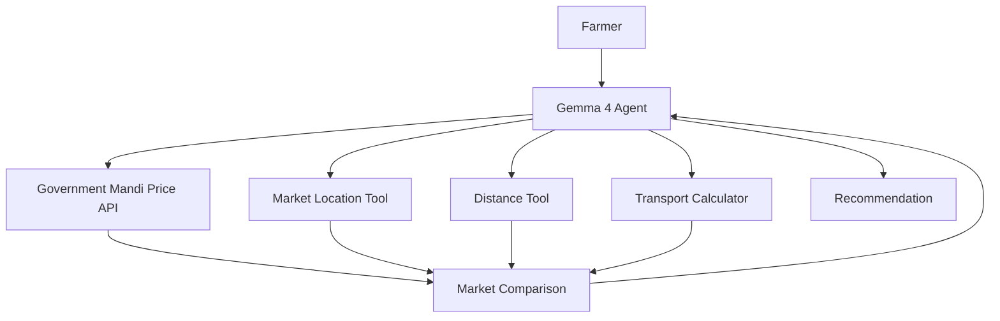

# Build MandiMind — Gemma 4 Agricultural Decision-Support Agent

## 0. Context

We are participating in the **Build with Gemma: TFUG Prayagraj [AI Prayagraj]** Kaggle hackathon.

The hackathon requires a functional AI application powered by **Gemma 4**, with strong emphasis on:

* Gemma Integration — 30%
* Innovation & Impact — 30%
* Functionality — 20%
* Presentation & Writeup — 20%

There are two tracks:

1. GenAI for Good — healthcare, agriculture, or civic engagement
2. Autonomous Agent — Gemma function calling and interaction with external APIs/tools

This project should target the **GenAI for Good / Agriculture** track while also demonstrating strong agentic/function-calling behavior.

The project is called:

# MandiMind

### Tagline

**From market prices to better selling decisions.**

### Core idea

MandiMind is an AI agricultural decision-support agent that helps a farmer compare nearby mandi/market options for selling a crop.

It should NOT simply display the highest mandi price.

Instead, it should combine:

1. Current Government of India mandi prices
2. Market location
3. Distance from the farmer
4. Estimated transportation cost
5. Farmer's quantity
6. Current modal price

to estimate which nearby market may provide the best **estimated net return**.

Gemma 4 should be the primary intelligence/agent layer responsible for understanding the user's request, deciding which tools are required, invoking those tools, interpreting their results, and explaining the recommendation.

Do NOT make Gemma responsible for deterministic arithmetic that can be performed reliably by Python.

---

# 1. IMPORTANT DEVELOPMENT PRINCIPLES

Follow these principles throughout the implementation.

### Principle 1 — Build a vertical slice first

Before implementing advanced features, get this complete flow working:

```text
User
 ↓
Gemma 4
 ↓
Current mandi price tool
 ↓
Market location
 ↓
Distance calculation
 ↓
Transport estimation
 ↓
Net return calculation
 ↓
Gemma 4
 ↓
Recommendation
```

Do not build unnecessary infrastructure before this works.

### Principle 2 — Current government data is the source of truth for prices

Use the official Government of India Open Government Data API.

Resource:

```text
https://api.data.gov.in/resource/9ef84268-d588-465a-a308-a864a43d0070
```

Dataset:

**Current Daily Price of Various Commodities from Various Markets (Mandi)**

The dataset is provided by:

* Ministry of Agriculture and Farmers Welfare
* Department of Agriculture and Farmers Welfare

Important fields:

```text
state
district
market
commodity
variety
grade
arrival_date
min_price
max_price
modal_price
```

The API has already been successfully tested.

### Principle 3 — Never expose the API key

The Government API key must be loaded from an environment variable.

Example:

```env
DATA_GOV_API_KEY=...
```

Never commit it to Git.

`.env` must be in `.gitignore`.

### Principle 4 — Do not claim guaranteed profit

Use wording such as:

* "estimated net return"
* "estimated transportation cost"
* "recommended based on current available data"
* "decision-support estimate"

Do NOT say:

* "guaranteed profit"
* "best market with certainty"
* "guaranteed future price"
* "this market will definitely give you the highest income"

### Principle 5 — Gemma should reason over tool results

Do not make the LLM invent prices, distances, transportation costs, or calculations.

The architecture should be:

```text
Government API → factual price data
Python tools → deterministic calculations
Gemma → orchestration, reasoning, explanation
```

---

# 2. MVP USER EXPERIENCE

The primary demo should support this scenario:

### User input

```text
Location: Prayagraj
Crop: Wheat
Quantity: 20 quintals
```

The user should also be able to express the same request naturally:

> "I have 20 quintals of wheat and I am in Prayagraj. Where should I sell today?"

Hindi should ideally work as well:

> "मेरे पास 20 क्विंटल गेहूं है और मैं प्रयागराज में हूं। आज कहां बेचना बेहतर रहेगा?"

However, Hindi support is secondary. Get the English workflow working first.

---

# 3. IMPORTANT REAL DATA DISCOVERIES

We have already tested the Government API.

### Unfiltered request

The personal API key works successfully.

### Uttar Pradesh

The following query returned:

```text
total = 87
```

for the current feed.

### Prayagraj

The query:

```text
state = Uttar Pradesh
district = Prayagraj
```

returned:

```text
total = 2
```

Current records:

```text
Prayagraj APMC
Tomato
Modal price = ₹2500

Prayagraj APMC
Potato
Modal price = ₹700
```

### Prayagraj + Wheat

This returned:

```text
total = 0
```

This is IMPORTANT.

MandiMind should not simply return "no results."

It should demonstrate agentic fallback behavior:

```text
Prayagraj + Wheat
        ↓
No current result
        ↓
Expand search to nearby markets
        ↓
Find current wheat markets
        ↓
Compare them
        ↓
Estimate logistics
        ↓
Recommend
```

### Uttar Pradesh + Wheat

The current API returned:

```text
total = 22
```

Example records included:

```text
Lalitpur APMC
Wheat
Mill Quality
₹2350

Salon APMC
Wheat
Dara
₹2575

Bachranwa APMC
Wheat
Dara
₹2400

Karvi APMC
Wheat
Deshi
₹2400

Pukharayan APMC
Wheat
Dara
₹2518.14

Babrala APMC
Wheat
Dara
₹2590

Jhijhank APMC
Wheat
Dara
₹2600

Rura APMC
Wheat
Dara
₹2501.19

Purwa APMC
Wheat
Dara
₹2500

Maigalganj APMC
Wheat
Dara
₹2600

Dibiapur APMC
Wheat
Dara
₹2550

Jarar APMC
Wheat
Dara
₹2562.13
```

These are current records and demonstrate that price varies significantly across markets.

Do not hardcode these prices into the application. They are provided here only as development context.

---

# 4. RECOMMENDED TECH STACK

Use a simple stack that can be completed quickly.

## Backend

Python + FastAPI

## Frontend

Use the fastest practical option.

Preferred:

```text
Streamlit
```

unless there is already an existing frontend scaffold that is significantly faster to use.

Do NOT spend hackathon time building a complex React application unless there is a strong reason.

## Data

Government data.gov.in API

## AI

Gemma 4 using the Gemma runtime/API that is available and practical in this development environment.

Before implementing the final agent integration, determine the available Gemma 4 execution/API method in this environment.

The architecture should isolate the model provider behind a small service layer so it can be changed without rewriting the application.

## Location

For the hackathon MVP, do NOT attempt to build a complete all-India mandi geospatial database.

Use a small cached market-location dataset for the candidate markets needed by the prototype.

---

# 5. PROJECT STRUCTURE

Create a clean structure approximately like:

```text
mandimind/
│
├── backend/
│   ├── main.py
│   ├── config.py
│   │
│   ├── agent/
│   │   ├── gemma_agent.py
│   │   ├── prompts.py
│   │   └── schemas.py
│   │
│   ├── tools/
│   │   ├── mandi_prices.py
│   │   ├── market_locations.py
│   │   ├── distance.py
│   │   ├── transport.py
│   │   └── returns.py
│   │
│   └── services/
│       └── data_gov.py
│
├── frontend/
│   └── app.py
│
├── data/
│   └── market_locations.csv
│
├── tests/
│   ├── test_mandi_api.py
│   ├── test_distance.py
│   ├── test_transport.py
│   └── test_returns.py
│
├── .env.example
├── .gitignore
├── requirements.txt
├── README.md
└── LICENSE
```

Adapt the structure if the existing repository has a better organization, but maintain clear separation between:

* API integration
* deterministic tools
* Gemma agent
* frontend

---

# 6. GOVERNMENT API SERVICE

Create:

```text
backend/services/data_gov.py
```

Implement a reusable API client.

Base URL:

```text
https://api.data.gov.in/resource/9ef84268-d588-465a-a308-a864a43d0070
```

Read the API key from:

```env
DATA_GOV_API_KEY
```

Use JSON.

Implement robust error handling:

* timeout
* HTTP errors
* invalid API key
* empty results
* malformed response
* rate limiting

Do not crash the entire application when the API returns no records.

Normalize API records into internal Python objects.

For example:

```python
{
    "state": "Uttar Pradesh",
    "district": "Raebareli",
    "market": "Salon APMC",
    "commodity": "Wheat",
    "variety": "Dara",
    "grade": "FAQ",
    "arrival_date": "09/08/2026",
    "min_price": 2575,
    "max_price": 2575,
    "modal_price": 2575
}
```

Round floating-point artifacts:

```text
2518.1399999999999 → 2518.14
2465.9899999999998 → 2465.99
```

---

# 7. MANDI PRICE TOOL

Create:

```text
backend/tools/mandi_prices.py
```

Expose a function/tool conceptually equivalent to:

```python
get_mandi_prices(
    state: str,
    commodity: str,
    district: str | None = None,
    market: str | None = None,
    variety: str | None = None,
    limit: int = 100
)
```

It should query the Government API.

Important behavior:

### If district has data

Return the records.

### If district + commodity has no data

Return a structured result like:

```json
{
  "status": "no_results",
  "message": "No current records found for Wheat in Prayagraj.",
  "records": []
}
```

This allows Gemma to decide what to do next.

---

# 8. MARKET LOCATION DATA

We need coordinates for markets.

Do NOT attempt to solve all Indian mandi coordinates during the first implementation.

Create:

```text
data/market_locations.csv
```

with fields:

```csv
market,district,state,latitude,longitude,source
```

Use reliable market/address information.

Potential sources include:

* official e-NAM mandi directory/address information
* official market information
* carefully verified geocoded coordinates

The purpose is to support the hackathon prototype.

Do not claim that this CSV represents every government-registered mandi in India.

The Government API remains the source of truth for current prices.

---

# 9. MARKET LOCATION TOOL

Create:

```text
backend/tools/market_locations.py
```

Implement:

```python
get_market_location(
    market: str,
    district: str,
    state: str
)
```

Return:

```json
{
  "market": "Salon APMC",
  "district": "Raebareli",
  "latitude": ...,
  "longitude": ...,
  "source": "..."
}
```

Also implement:

```python
find_nearby_candidate_markets(
    origin_latitude,
    origin_longitude,
    candidate_markets,
    max_distance_km
)
```

---

# 10. ORIGIN LOCATION

For the MVP, support:

### Option A

User enters a known city/district:

```text
Prayagraj
```

Map that to coordinates using a small origin-location dataset.

### Option B

If geolocation is available, allow coordinates.

Do not make browser GPS permissions mandatory.

The user should be able to enter:

```text
Prayagraj
```

and proceed.

---

# 11. DISTANCE TOOL

Create:

```text
backend/tools/distance.py
```

Implement a deterministic geographic distance calculation.

For the MVP, straight-line/Haversine distance is acceptable.

Do NOT represent this as driving distance.

The UI should say:

> Approximate geographic distance

unless a proper routing service is later added.

If time permits, a routing API can be added later, but it is not required for the first MVP.

---

# 12. TRANSPORT COST MODEL

Create:

```text
backend/tools/transport.py
```

Implement:

```python
estimate_transport_cost(
    distance_km: float,
    quantity_quintals: float,
    rate_per_quintal_km: float
)
```

Use a clearly documented prototype assumption.

Make the transport rate configurable.

For example:

```env
TRANSPORT_RATE_PER_QUINTAL_KM=...
```

Do NOT present the rate as an official government rate.

The UI should clearly display:

> Transport cost is an estimate based on the configured prototype rate.

Keep this model simple.

Do not attempt to model every real-world cost.

---

# 13. NET RETURN CALCULATION

Create:

```text
backend/tools/returns.py
```

Implement:

```python
calculate_estimated_return(
    quantity_quintals,
    modal_price,
    estimated_transport_cost
)
```

Formula:

```text
gross_value = quantity_quintals × modal_price

estimated_net_return =
    gross_value - estimated_transport_cost
```

Do not ask Gemma to perform this arithmetic.

Return structured data:

```json
{
  "quantity_quintals": 20,
  "modal_price": 2575,
  "gross_value": 51500,
  "estimated_transport_cost": 1200,
  "estimated_net_return": 50300
}
```

---

# 14. MARKET COMPARISON PIPELINE

Create a service that performs:

```text
1. Retrieve current crop markets
2. Resolve market coordinates
3. Calculate distance
4. Filter by reasonable radius
5. Estimate transport
6. Calculate gross value
7. Calculate estimated net return
8. Rank candidates
```

For example:

```python
rank_market_options(
    origin,
    state,
    commodity,
    quantity_quintals,
    search_radius_km
)
```

Return a list sorted by estimated net return.

Important:

The deterministic ranking should be done by Python.

Gemma should interpret/explain the results rather than invent the ranking.

---

# 15. AGENTIC FALLBACK BEHAVIOR

This is a major demo feature.

Suppose:

```text
Prayagraj + Wheat
```

returns zero records.

Gemma should recognize that and call the broader search tool.

Conceptually:

```text
User:
"I have 20 quintals of wheat and I'm in Prayagraj."

Gemma:
→ Search Prayagraj wheat

Tool:
→ No current records

Gemma:
→ Search nearby Uttar Pradesh markets for wheat

Tool:
→ 22 candidate records

Gemma:
→ Filter/rank nearby markets

Tools:
→ Distance
→ Transport
→ Return calculation

Gemma:
→ Explain recommendation
```

The exact implementation may vary depending on the available Gemma 4 function-calling interface.

---

# 16. GEMMA AGENT

Create:

```text
backend/agent/gemma_agent.py
```

Gemma should have access to the following tools:

### Tool 1

```text
get_mandi_prices
```

Purpose:

Retrieve current government mandi prices.

### Tool 2

```text
find_nearby_candidate_markets
```

Purpose:

Find candidate markets within a search radius.

### Tool 3

```text
calculate_distance
```

Purpose:

Calculate approximate geographic distance.

### Tool 4

```text
estimate_transport_cost
```

Purpose:

Estimate transportation cost using configured assumptions.

### Tool 5

```text
calculate_estimated_return
```

Purpose:

Calculate gross and estimated net return.

Do not give Gemma direct access to arbitrary Python execution.

Only expose explicitly defined tools.

---

# 17. GEMMA SYSTEM INSTRUCTIONS

Create a strong system prompt.

The conceptual rules should be:

```text
You are MandiMind, an agricultural decision-support agent.

Your job is to help farmers compare current mandi selling options.

Use current Government of India mandi data whenever discussing current prices.

Never invent market prices.

Never invent distances.

Never invent transport costs.

Use tools to obtain factual data and deterministic calculations.

If the requested commodity is unavailable in the user's district,
expand the search to nearby candidate markets.

Do not recommend a distant market solely because it has a higher price.

Consider estimated transportation costs and quantity.

Clearly distinguish:
- government-reported current market prices
- calculated values
- assumptions
- AI-generated interpretation

Never claim guaranteed profit or guaranteed future prices.

When information is insufficient, ask the user for the missing information.

Explain recommendations in simple language.

If the user speaks Hindi, respond in Hindi.
If the user speaks English, respond in English.
```

Adapt this to the actual Gemma 4 API/tool-calling format.

---

# 18. IMPORTANT GEMMA BEHAVIOR

Gemma should not immediately jump to a recommendation.

It should gather enough information.

Minimum required information:

```text
crop
quantity
origin/location
```

If quantity is missing:

> "How much produce do you plan to sell?"

If location is missing:

> "Which village, town, or district are you selling from?"

If crop is missing:

> "Which crop are you planning to sell?"

Do not ask unnecessary questions.

---

# 19. FRONTEND

Build a simple but polished interface.

Do not over-design.

Suggested layout:

```text
--------------------------------------------------
                  MandiMind
       From market prices to better decisions

  Current Government Mandi Data • Gemma 4 Agent
--------------------------------------------------

Where are you selling from?
[ Prayagraj                         ]

What are you selling?
[ Wheat                            ]

How much?
[ 20 ] [ Quintals ▼ ]

Search radius
[ 100 km ▼ ]

              [ Find Best Market ]

--------------------------------------------------
```

Then show agent progress:

```text
✓ Understanding request
✓ Checking government mandi prices
✓ Finding nearby markets
✓ Estimating transportation
✓ Comparing expected returns
✓ Preparing recommendation
```

Do not fake progress.

Only show stages corresponding to actual execution.

---

# 20. RESULT UI

The main result should have a strong recommendation card.

Example:

```text
Recommended Market

Salon APMC
Raebareli

Estimated net return
₹50,300

Modal price
₹2,575 / quintal

Approx. distance
115 km

Estimated transport
₹1,200

--------------------------------

Why this market?

Although another market may have a slightly
higher modal price, this option provides the
highest estimated net return among the
markets considered within your selected radius.
```

Then show:

### Market comparison

```text
Market       Price    Distance    Transport    Net Return
----------------------------------------------------------
Market A     ₹2575    115 km      ₹1200        ₹50300
Market B     ₹2600    180 km      ₹1900        ₹50100
Market C     ₹2550     95 km      ₹900         ₹50100
```

Use proper currency formatting.

---

# 21. DATA PROVENANCE

Always display something like:

```text
Price source:
Government of India Open Government Data Platform

Dataset:
Current Daily Price of Various Commodities from Various Markets (Mandi)

Data date:
09 Aug 2026
```

Do not imply government endorsement of MandiMind.

Use wording such as:

> "Market price data sourced from the Government of India's Open Data Platform."

---

# 22. TRANSPARENCY PANEL

Add a collapsible section:

```text
How was this calculated?
```

Show:

```text
Government modal price
₹2,575/quintal

Quantity
20 quintals

Gross value
₹51,500

Approximate distance
115 km

Estimated transport
₹1,200

Estimated net return
₹50,300
```

Also display:

> Transportation cost is an estimate based on a prototype assumption and may differ from actual local costs.

This makes the application trustworthy.

---

# 23. HINDI SUPPORT

After the English flow works, support Hindi.

Example:

```text
मेरे पास 20 क्विंटल गेहूं है और मैं प्रयागराज में हूं।
आज कहां बेचना बेहतर रहेगा?
```

The agent should understand the request and respond in Hindi.

Do not build a separate translation model unless necessary.

Use Gemma's multilingual capabilities.

---

# 24. ERROR HANDLING

Handle:

### API unavailable

Display:

> "Government market data is temporarily unavailable. Please try again."

### No local market

Display:

> "No current listing was found for this crop in your district. MandiMind is checking nearby markets."

### No nearby market

Display:

> "No suitable market was found within the selected radius."

### Missing coordinates

Do not silently guess.

Mark that market as unavailable for distance-based ranking.

### Invalid quantity

Reject negative/zero/non-numeric quantity.

### API key missing

Display a developer-friendly error during development, but never expose the key.

---

# 25. TESTING

Create unit tests for:

### API parsing

Verify the government API response is normalized correctly.

### Price rounding

Verify:

```text
2465.9899999999998 → 2465.99
```

### Distance

Test known coordinate pairs.

### Transport

Test deterministic calculations.

### Return

Test:

```text
20 × 2575 = 51500
```

before transport.

### No-result behavior

Test:

```text
Prayagraj + Wheat
```

returns an empty result and triggers fallback behavior.

### Agent

Test at least:

```text
"I have 20 quintals of wheat in Prayagraj."
```

and:

```text
"मेरे पास 20 क्विंटल गेहूं है और मैं प्रयागराज में हूं।"
```

---

# 26. DO NOT OVERENGINEER

Do NOT build:

* authentication
* user accounts
* payments
* databases unless genuinely needed
* farmer profiles
* recommendation history
* mobile apps
* complex dashboards
* predictive ML models
* price forecasting
* sophisticated logistics optimization
* all-India mandi mapping
* production-grade infrastructure

These are outside the hackathon MVP.

---

# 27. OPTIONAL FEATURES — ONLY AFTER MVP WORKS

If the complete MVP is working, consider these in order:

### Priority A

Hindi support.

### Priority B

Interactive map showing:

```text
Farmer
 ↓
Candidate markets
```

### Priority C

Price range visualization:

```text
Min ───── Modal ───── Max
```

### Priority D

"Why not the highest price?" explanation.

### Priority E

Scenario simulator:

```text
What if transport costs increase by 20%?
```

Do not implement these until the core agent is working.

---

# 28. DEMO SCENARIO

The primary hackathon demonstration should be:

```text
Location: Prayagraj
Crop: Wheat
Quantity: 20 quintals
```

The important behavior:

```text
Prayagraj + Wheat
→ No current local record

Gemma recognizes this.

→ Searches broader nearby market candidates

→ Finds current Uttar Pradesh wheat records

→ Gets market locations

→ Calculates approximate distances

→ Estimates transport

→ Calculates estimated net returns

→ Compares markets

→ Gives recommendation

→ Explains why the recommended market is preferable
```

This is the core story of the project.

---

# 29. SECOND DEMO SCENARIO

Create a second scenario where local data exists.

For example:

```text
Location: Prayagraj
Crop: Potato
Quantity: 20 quintals
```

The current government API has a Prayagraj potato record:

```text
Prayagraj APMC
Potato
Modal price ₹700
```

Use this to demonstrate the local-data path.

This gives the judges two contrasting scenarios:

### Scenario 1

Local data exists.

### Scenario 2

Local data does not exist → agent expands search.

This demonstrates adaptive behavior.

---

# 30. README

Create a polished README containing:

```text
# MandiMind

From market prices to better selling decisions.

## Problem

## Solution

## How it works

## Architecture

## Gemma 4 integration

## Government data source

## Installation

## Environment variables

## Running locally

## Example

## Limitations

## Future work
```

Include an architecture diagram in Mermaid if appropriate.

Example:



---

# 31. SECURITY

`.gitignore` must contain:

```text
.env
__pycache__/
*.pyc
.venv/
venv/
```

Create:

```text
.env.example
```

with:

```env
DATA_GOV_API_KEY=
TRANSPORT_RATE_PER_QUINTAL_KM=
```

Never commit the actual API key.

---

# 32. DEPLOYMENT

The final application must be publicly accessible.

Prioritize speed.

A simple Streamlit deployment is acceptable.

The backend/API key must remain server-side.

Do not put:

```text
DATA_GOV_API_KEY
```

into frontend JavaScript.

Verify:

1. Application loads without authentication.
2. User can submit the demo request.
3. Government API is called successfully.
4. Gemma responds.
5. Recommendation is displayed.
6. No secret appears in browser source or GitHub.

---

# 33. WRITEUP PREPARATION

After the application works, prepare material for the Kaggle writeup.

The writeup must remain under the 1,500-word limit.

Suggested structure:

## Title

**MandiMind: From Market Prices to Better Selling Decisions**

## Subtitle

**A Gemma 4 agricultural decision-support agent combining government mandi data, location and logistics estimates.**

## Sections

### 1. The Problem

Farmers may see different mandi prices, but the highest price does not necessarily mean the best economic outcome because transportation and quantity matter.

### 2. The Solution

MandiMind turns current mandi data into an actionable comparison.

### 3. How Gemma 4 Is Used

Explain:

* natural language understanding
* tool selection
* function calling
* fallback behavior
* reasoning
* multilingual interaction
* final explanation

### 4. Data

Government of India Open Government Data mandi-price API.

### 5. Architecture

Show the tool architecture.

### 6. Example

Show the Prayagraj/Wheat scenario.

### 7. Limitations

Clearly state:

* current-feed availability
* approximate distance
* estimated transport cost
* no guaranteed future price
* no guaranteed profit

### 8. Future Work

Potentially:

* more comprehensive mandi geolocation
* real-time routing
* better transport estimates
* historical price analysis
* weather integration
* additional crops
* more regional languages

---

# 34. IMPORTANT WRITING/CLAIM GUIDELINES

Do not say:

> "MandiMind predicts the best mandi."

Say:

> "MandiMind estimates which considered market may provide the highest net return based on current available mandi prices and estimated logistics."

Do not say:

> "Our AI guarantees farmers more money."

Say:

> "The system provides transparent decision support."

Do not say:

> "All Indian mandi data is covered."

Say:

> "The prototype uses the current Government of India mandi-price feed and a geospatial candidate layer."

---

# 35. DEVELOPMENT ORDER

Work in this exact order.

## STEP 1

Inspect the current workspace/repository.

Do not overwrite existing useful work.

Report what already exists.

## STEP 2

Set up the Python backend and dependencies.

## STEP 3

Implement the Government API client.

## STEP 4

Verify:

```text
Uttar Pradesh + Wheat
```

works programmatically.

## STEP 5

Implement normalized market objects.

## STEP 6

Create the small market-location dataset required for the demo.

## STEP 7

Implement distance calculation.

## STEP 8

Implement transport estimation.

## STEP 9

Implement net-return calculation.

## STEP 10

Implement market ranking.

At this point the complete deterministic pipeline should work WITHOUT Gemma.

## STEP 11

Add Gemma 4.

## STEP 12

Expose the deterministic functions as Gemma tools.

## STEP 13

Implement agentic fallback for no local results.

## STEP 14

Build the Streamlit UI.

## STEP 15

Add Hindi support.

## STEP 16

Add transparency/provenance UI.

## STEP 17

Test the complete demo.

## STEP 18

Deploy.

## STEP 19

Create README.

## STEP 20

Prepare Kaggle writeup assets.

---

# 36. ACCEPTANCE CRITERIA

Do not consider the project complete until all of these work:

### Data

* [ ] Government API successfully called
* [ ] API key stored securely
* [ ] Current mandi prices parsed
* [ ] Price data displayed correctly

### Agent

* [ ] Gemma 4 is actually used
* [ ] Gemma can call tools
* [ ] Gemma can handle natural language
* [ ] Gemma can handle missing local data
* [ ] Gemma explains its recommendation
* [ ] Hindi request works if time permits

### Decision engine

* [ ] Distance calculated
* [ ] Transport estimated
* [ ] Gross value calculated
* [ ] Estimated net return calculated
* [ ] Markets ranked deterministically

### UI

* [ ] Farmer can enter crop
* [ ] Farmer can enter quantity
* [ ] Farmer can enter location
* [ ] Recommendation is clearly visible
* [ ] Comparison table is visible
* [ ] Data source is visible
* [ ] Assumptions are visible

### Security

* [ ] API key not committed
* [ ] `.env` ignored
* [ ] `.env.example` provided

### Submission

* [ ] Public GitHub repository
* [ ] Public live demo
* [ ] README
* [ ] Architecture diagram
* [ ] Kaggle writeup
* [ ] Demo scenario rehearsed

---

# 37. FINAL INSTRUCTION TO THE DEVELOPMENT AGENT

Start by inspecting the current repository/workspace and then implement the project incrementally.

Do NOT spend time polishing the UI before the end-to-end technical flow works.

Do NOT create fake data when the Government API can provide real data.

Do NOT hardcode current mandi prices into application logic.

Do NOT expose secrets.

Do NOT invent coordinates when they are unknown.

Do NOT let Gemma invent calculations.

The most important milestone is:

```text
"20 quintals of wheat + Prayagraj"
        ↓
Gemma 4
        ↓
Government mandi API
        ↓
No local wheat result
        ↓
Nearby candidate markets
        ↓
Distance
        ↓
Transport estimate
        ↓
Estimated net return
        ↓
Gemma 4 reasoning
        ↓
Transparent recommendation
```

Get this working end-to-end first.

Once this works, stop adding major features and focus on:

1. reliability
2. demo quality
3. README
4. Kaggle writeup
5. deployment
6. final presentation.

The objective is not to build a production agricultural platform in one day.

The objective is to build a **convincing, functional, technically credible Gemma 4 agent that solves a real agricultural decision problem using real Government of India data.**
